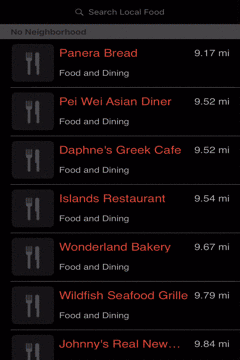
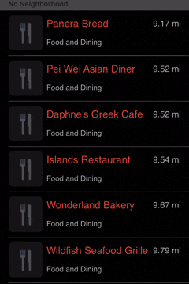
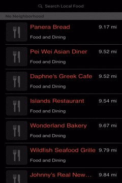

     <h1>Current for iOS </h1> <h3> A local place finder</h3>

 

### Screenshots

<table align="center" border="0">

<tr>
<td>  </td>
<td>  </td>
<td>  </td>
</tr>

</table>

### Features

- Simplistic UI
- Ability to call, check website, or get directions from any location
- Quickly determine if location is currently open based on color of title

### Build Notes

To build this project, just install the required pods by running the following command in the project directory:

    pod install

### License
This project is licensed under the MIT License, see [here](https://opensource.org/licenses/MIT) for more information.
